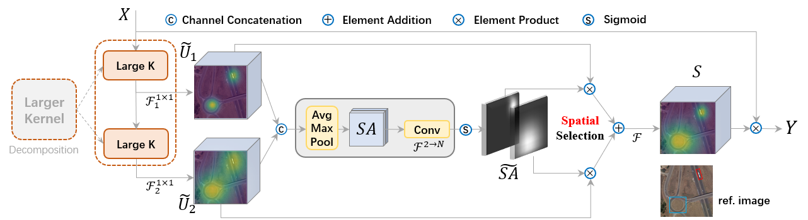
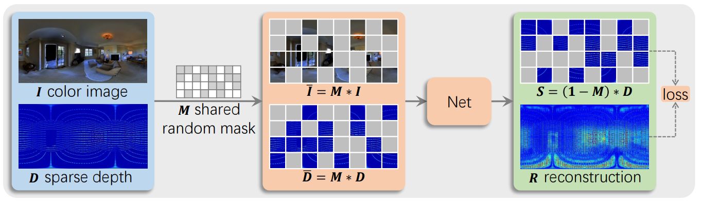

# Research
This repo holds the most research projects of our lab.
(* indicates equal contribution, # corresponding author)

  <h2>2023</h2>
        

            
<strong>Large Selective Kernel Network for Remote Sensing Object Detection</strong> 
		Yuxuan Li, Qibin Hou, Zhaohui Zheng, Ming-Ming Cheng, Jian Yang#, Xiang Li# 
                in ICCV, 2023 
                <a href="https://arxiv.org/pdf/2303.09030.pdf">[Paper]</a>
                <a href="./resources/bibtex/AAAI_2023_CTKD.txt">[BibTex]</a>
                <a href="https://github.com/zcablii/LSKNet">[Code]</a>
                 
                
                
                 
                <alert>
        LSKNet can dynamically adjust its large spatial receptive field to better model the ranging context of various categories of objects in remote sensing scenarios
		</alert>
            

            

        

 <h2></h2>
	

            
<strong>Curriculum Temperature for Knowledge Distillation</strong> 
		Zheng Li, Xiang Li#, Lingfeng Yang, Borui Zhao, Renjie Song, Lei Luo, Jun Li, Jian Yang# 
                in AAAI, 2023 
                <a href="https://arxiv.org/pdf/2211.16231.pdf">[Paper]</a>
                <a href="./resources/bibtex/AAAI_2023_CTKD.txt">[BibTex]</a>
                <a href="https://github.com/zhengli97/CTKD">[Code]</a>
                 
                <alert>
        CTKD organizes the distillation task from easy to hard through a dynamic and learnable temperature. The temperature is learned during the student’s training process with a reversed gradient that aims to maximize the distillation loss in an adversarial manner.
		</alert>
            

            

        

  <h2></h2>

  <h2>2022</h2>
	

            
<strong>RecursiveMix: Mixed Learning with History</strong> 
		Lingfeng Yang*, Xiang Li*, Borui Zhao, Renjie Song, Jian Yang# 
                in NeurIPS (<strong>Spotlight</strong>), 2022 
                <a href="https://arxiv.org/pdf/2203.06844.pdf">[Paper]</a>
                <a href="https://github.com/implus/implus.github.io/tree/master/resources/bibtex/NeurIPS_2022_RM.txt">[BibTex]</a>
                <a href="https://github.com/implus/RecursiveMix-pytorch">[Code]</a>
                 
                <alert>
        RecursiveMix is a simple but effective data augmentation technique that first leverages the historical input-prediction-label triplets.
		</alert>
            

            

        
        
	
  <h2></h2>
  	

            
<strong>DTG-SSOD: Dense Teacher Guidance for Semi-Supervised Object Detection</strong> 
		Gang Li, Xiang Li#, Yujie Wang, Yichao Wu, Ding Liang, Shanshan Zhang# 
                in NeurIPS, 2022 
                <a href="https://openreview.net/pdf?id=0-uBrFiOVf">[Paper]</a>
                <a href="./resources/bibtex/NeurIPS_2022_DTG.txt">[BibTex]</a>
                <a href="https://github.com/ligang-cs/DTG-SSOD">[Code(to be released)]</a>
                 
                <alert>
        DTG-SSOD explores a novel “dense-to-dense” paradigm, instead of the traditional  “sparse-to-dense” paradigm, for effective semi-supervised object detection.
		</alert>
            

            

        

	
  <h2></h2>	
	

            
<strong>PseCo: Pseudo Labeling and Consistency Training for Semi-Supervised Object Detection</strong> 
		Gang Li, Xiang Li#, Yujie Wang, Yichao Wu, Ding Liang, Shanshan Zhang# 
                in ECCV, 2022 
                <a href="https://arxiv.org/pdf/2203.16317.pdf">[Paper]</a>
                <a href="./resources/bibtex/ECCV_2022_PseCo.txt">[BibTex]</a>
                <a href="https://github.com/ligang-cs/PseCo">[Code]</a>
                <a href="https://zhuanlan.zhihu.com/p/544346080">[Blog(Chinese)]</a>
		<a href="https://www.bilibili.com/video/BV1DP411j7kg/">[Video(Chinese)]</a>
                 
                <alert>
        PseCo delves into two key techniques of semi-supervised learning (e.g., pseudo labeling and consistency training) for SSOD, and integrate object detection properties into them. 
		</alert>
            

            

        

	
  <h2></h2>	
	

            
<strong>Multi-Modal Masked Pre-Training for Monocular Panoramic Depth Completion</strong> 
		Zhiqiang Yan*, Xiang Li*, Kun Wang, Zhenyu Zhang, Jun Li#, Jian Yang# 
                in ECCV, 2022 
                <a href="https://www.ecva.net/papers/eccv_2022/papers_ECCV/papers/136610372.pdf">[Paper]</a>
                <a href="./resources/bibtex/ECCV_2022_M3PT.txt">[BibTex]</a>
                 
                <alert>
        M3PT is the first multi-model masked pretraining framework for monocular panoramic depth completion which significantly improves the performance.
		</alert>
            

            

        

  <h2></h2>
  	

            
<strong>Uniform Masking: Enabling MAE Pre-training for Pyramid-based Vision Transformers with Locality</strong> 
		Xiang Li, Wenhai Wang, Lingfeng Yang, Jian Yang# 
                in arXiv, 2022 
                <a href="https://arxiv.org/pdf/2205.10063.pdf">[Paper]</a>
                <a href="./resources/bibtex/arXiv_2022_UMMAE.txt">[BibTex]</a>
                <a href="https://github.com/implus/UM-MAE">[Code]</a>
                <a href="https://zhuanlan.zhihu.com/p/520228061">[Blog(Chinese)]</a>
                 
                <alert>
        UM-MAE is an efficient and general technique that supports MAE-style MIM Pre-training for popular Pyramid-based Vision Transformers (e.g., PVT, Swin).
		</alert>
            

            

        

	
  <h2></h2>
  	

            
<strong>Dynamic MLP for Fine-Grained Image Classification by Leveraging Geographical and Temporal Information</strong> 
		Lingfeng Yang, Xiang Li#, Renjie Song, Borui Zhao, Juntian Tao, Shihao Zhou, Jiajun Liang, Jian Yang# 
                in CVPR (<strong>Oral</strong>), 2022 
                <!-- <a href="https://arxiv.org/pdf/2106.13797.pdf">[Paper]</a> -->
                <a href="https://arxiv.org/pdf/2203.03253.pdf">[Paper]</a>
                <a href="./resources/bibtex/dynamicMLP.txt">[BibTex]</a>
                <a href="https://github.com/ylingfeng/DynamicMLP">[Code]</a>
                 
                <alert>
		A very simple and effective approach for fine-grained recognition tasks using auxiliary knowledge like geographical/temporal information. We achieve SOTA results and take third place in the iNaturalist challenge at FGVC8 (CVPR21 workshop)
		</alert>
            

            

        

	
  <h2></h2>	
	

            
<strong>Knowledge Distillation for Object Detection via Rank Mimicking and Prediction-guided Feature Imitation</strong> 
		Gang Li*, Xiang Li*, Yujie Wang, Shanshan Zhang#, Yichao Wu, Ding Liang 
                in AAAI, 2022 
                <!-- <a href="https://arxiv.org/pdf/2106.13797.pdf">[Paper]</a> -->
                <a href="https://arxiv.org/pdf/2112.04840.pdf">[Paper]</a>
                <a href="./resources/bibtex/kd_rm_pfi.txt">[BibTex]</a>
                 
                <alert>Rank Mimicking and Prediction-guided Feature Imitation for knowledge Distillation of Dense Object Detection, A Simple and Effective Approach!</alert>
            

            

        

